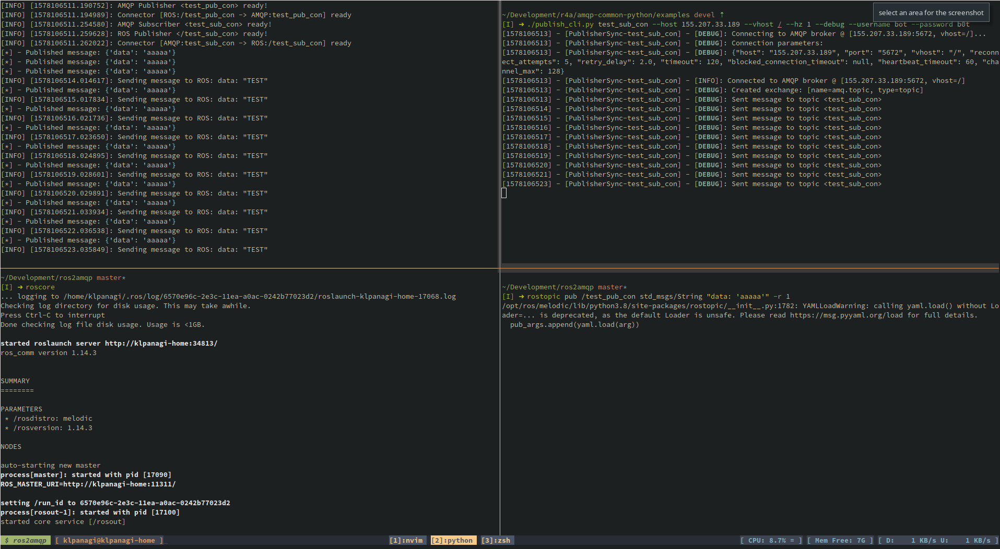

# dotfiles

My terminal-based experience...

## Some usefull cli tools to consider installing

- [grip](https://github.com/joeyespo/grip): GitHub Readme Instant Preview.

# Dependencies

- networkmanager-dmenu
- polybar
- rofi
- zsh
- vim/nvim
